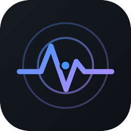
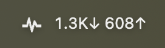

<div align="center">



# netscope

**See which apps are using your network — live, right from the menu bar.**

A per-app network traffic monitor for macOS, in the spirit of RunCat / iStat:
always-on, glanceable, and useful for everyone. Everything runs locally — no
traffic contents are read and no data leaves your Mac. The capture daemon opens
no network port (it serves over a unix socket); only the dashboard window is fed
by a loopback-only (127.0.0.1) address.

[](https://github.com/doldoldol21/netscope/releases)
[](LICENSE)




*live download / upload, always in your menu bar*

</div>

## ⚡ Quick Start

```sh
curl -fsSL https://raw.githubusercontent.com/doldoldol21/netscope/main/install.sh | bash
```

That's it — `netscope.app` lands in **/Applications** and launches. **No
Gatekeeper warning** (curl-fetched apps aren't quarantined), no Homebrew, no
Apple account. The installer asks for your admin password **once, right there in
the terminal**, to set up the capture helper — so the app itself opens with no
pop-up dialogs, live in your menu bar and starting at boot.

Click the menu-bar icon for the popover — live rate, top apps, and an **Open
Dashboard** button for the full window. (The installer also sets it to start at
login.)

> **One app, fully self-managing.** Capture needs root (`/dev/bpf*`), so the app
> installs a small root daemon (the one admin prompt) that serves data over a
> local **Unix socket** — the daemon opens no network port. Prefer the terminal?
> `brew install doldoldol21/netscope/netscope-cli` builds the `netscoped` and
> `netscope` binaries from source.

## What you get

- **Menu bar** — live ↓↑ throughput, today's total, and a dropdown of the top
  apps (RunCat-style).
- **Usage alerts** — get a macOS notification when today's traffic crosses a
  daily total cap, or when any single app passes a per-app cap (set them from the
  popover's ⚙ button). Catches surprise backups and cloud-sync uploads.
- **Dashboard** — a separate native window: throughput chart, today/week
  rankings, and per-domain breakdown with neutral categories (cloud, cdn, ai, …).
- **CLI** — `netscope`, `netscope apps --range week`, `netscope domains` …
- **Private by design** — HTTPS stays encrypted; netscope only counts *bytes per
  process* and maps IPs to domains by watching your own DNS replies.

## How it works

```
┌── netscoped (root, launchd) ──────────────────────┐
│  libpcap capture ─► decode (IP/TCP/UDP + DNS)      │
│        │                    │                       │
│        ▼                    ▼                       │
│  resolver (libproc)    dnscache (IP→domain)        │
│   socket→PID→app       + reverse DNS               │
│        │                    │                       │
│        └──────► engine (attribute + aggregate)      │
│                     │            │                  │
│                     ▼            ▼                  │
│                 SQLite       live snapshot          │
│                     └─────┬────────┘                │
│                           ▼                          │
│                   /api over UNIX SOCKET             │
└───────────────────────────┬────────────────────────┘
              unix:///var/run/netscope/netscoped.sock  (0600, owned by you)
         ┌───────────────────┴───────────────────┐
         ▼                                        ▼
  netscope.app  (one app)                   netscope CLI
  menu bar + dashboard; installs            terminal viewer
  and manages the daemon for you
```

### Why a daemon, wrapped in one app

Packet capture needs root (`/dev/bpf*`); a GUI must run unprivileged in your
login session. netscope keeps these separate under the hood but ships them as a
**single `netscope.app`**:

- **`netscoped`** (bundled inside the app) — runs as root under launchd,
  captures and aggregates, and serves `/api` on a unix socket. The daemon opens
  no network port, so no remote host can reach your traffic data; access is
  gated by the socket file's ownership (chowned to you, mode `0600`).
- **`netscope.app`** — a menu-bar app (no dock icon): a native `NSStatusItem`
  (cgo) with a frameless **Wails popover** that drops down from it showing the
  live rate, sparkline and top apps. It **installs the daemon on first run**.
  Its "Open Dashboard" button opens a **separate native window** (an `NSWindow`
  hosting a `WKWebView`) with the full dashboard (`internal/webui`, vanilla
  JS/CSS, no Node build) — a real, movable window with native controls,
  independent of the popover. That window is fed by a loopback-only (127.0.0.1)
  server which serves the UI and reverse-proxies `/api` (incl. the live SSE
  stream) to the socket.
- **`netscope`** — a CLI that reads the same socket for terminal views.

## Install

- **App (recommended):** the [Quick Start](#-quick-start) one-liner. Installs
  `netscope.app` to /Applications with no Gatekeeper prompt.
- **CLI / Homebrew:** `brew install doldoldol21/netscope/netscope-cli` — builds
  the `netscoped` and `netscope` binaries from source (also no Gatekeeper, since
  compiled locally).
- **Direct download:** grab `netscope.app` from the
  [latest release](https://github.com/doldoldol21/netscope/releases). If you
  download it in a browser, clear the quarantine flag once:
  `xattr -dr com.apple.quarantine /Applications/netscope.app`.

> Want a notarized, zero-step download instead? That needs an Apple Developer
> account; the signing/notarization hooks are wired in `scripts/package.sh`
> (`NETSCOPE_SIGN_ID` / `NETSCOPE_NOTARY_PROFILE`).

### Uninstall

```sh
# stop & remove the capture daemon
sudo launchctl bootout system/io.netscope.daemon 2>/dev/null
sudo rm -f /Library/LaunchDaemons/io.netscope.daemon.plist
# remove the app and its data
rm -rf /Applications/netscope.app
launchctl bootout gui/$(id -u)/io.netscope.app 2>/dev/null  # stop the login item
rm -f ~/Library/LaunchAgents/io.netscope.app.plist          # "start at login", if set
sudo rm -rf /var/db/netscope /var/run/netscope
```

### From source

Requires Go 1.24+ and macOS (Xcode Command Line Tools for the C toolchain).

```sh
git clone https://github.com/doldoldol21/netscope
cd netscope
make build          # bin/netscoped, bin/netscope
```

Build the menu-bar app (`netscope.app`, with the daemon bundled inside):

```sh
go install github.com/wailsapp/wails/v2/cmd/wails@latest   # once (build-app.sh auto-installs)
make app                              # dist/netscope.app  (cgo NSStatusItem + Wails popover)
make build                            # bin/netscoped, bin/netscope (CLI/daemon only)
```

### Packaging a release

```sh
make package        # build-app.sh + CLI + installer into dist/, ad-hoc signed
```

`dist/` gets `netscope.app`, a `netscope-<version>-app.zip`, the `netscope` CLI
and `install.sh`. Icons are generated from `assets/app-icon.svg` via `make
icons`. For a notarized build (no manual quarantine clear on downloaded copies),
set `NETSCOPE_SIGN_ID` (Developer ID) and `NETSCOPE_NOTARY_PROFILE`.

## Usage

### Live capture (needs root)

```sh
sudo bin/netscoped           # capture + serve the API on the unix socket
bin/netscope open            # launch the native app
```

Packet capture reads `/dev/bpf*`, which requires root. Running under launchd
(`make install`) is the recommended way to avoid `sudo`. The daemon chowns the
socket to you so the (unprivileged) app and CLI can connect.

### CLI viewer (no root — talks to the running daemon)

```sh
bin/netscope                 # live terminal table (default: "top")
bin/netscope apps --range week
bin/netscope domains --range today
bin/netscope open            # launch the native app
```

`--range` is one of `hour | today | day | week`. Point at a non-default socket
with `--sock /path/to.sock`.

### Demo / development (no root)

One command — runs a synthetic-traffic daemon and launches the menu-bar app,
showing realistic named apps (Claude, ChatGPT, Safari, Spotify, …). Look at the
menu bar; use the menu's "Open Dashboard…" for the window:

```sh
make demo            # Ctrl-C (or the menu's Quit) to stop; uses a user-writable dev socket
```

For dashboard UI hot-reload, split it across two terminals (both use the dev
socket automatically, no env var needed):

```sh
make demo-daemon     # terminal 1: synthetic daemon
make app-dev         # terminal 2: dashboard with live-reload
```

To exercise the real capture pipeline from a file (note: apps show as
`unknown` because the original sockets no longer exist — domains still resolve):

```sh
go run tools/gensample.go testdata/sample.pcap
make run-pcap PCAP=testdata/sample.pcap
```

## Daemon flags

```
--iface       interface to capture (default: auto-detect)
--pcap        replay a pcap file instead of live capture (no root)
--demo        serve synthetic named-app traffic (no root; for UI/dev)
--sock        unix socket to serve the API on (default /var/run/netscope/netscoped.sock,
              or $NETSCOPE_SOCK)
--db          SQLite path (default /var/db/netscope/netscope.db as root)
--no-store    run in memory only, no persistence
--bucket      aggregation/flush granularity (default 10s)
--retention   how long to keep samples (default 720h; 0 = forever)
--live-window keep apps/domains in the live "session" view if active within this
              window (default 30m; 0 = whole session)
--print       also print top apps to stdout periodically
```

## API (over the unix socket)

The daemon serves JSON on the unix socket only — no static files, no TCP. Probe
it with `curl --unix-socket /var/run/netscope/netscoped.sock http://x/api/health`.

| Endpoint | Description |
|---|---|
| `GET /api/snapshot` | current live snapshot (rates + session apps/domains) |
| `GET /api/live` | Server-Sent Events stream of snapshots (1/s) |
| `GET /api/apps?range=today` | per-app totals over a range |
| `GET /api/domains?range=today` | per-domain totals over a range |
| `GET /api/summary?range=today` | totals, app/domain counts, top app + top domain |
| `GET /api/timeseries?range=day&step=60` | rx/tx time series |
| `GET /api/health` | liveness + persistence status |

## How attribution works

- **bytes → process**: macOS has no "4-tuple → PID" syscall, so the resolver
  periodically enumerates every process' socket file descriptors via `libproc`
  (`proc_pidinfo` / `proc_pidfdinfo`) and builds a reverse index keyed by
  protocol + local port + remote endpoint. Lookups rescan on demand (rate
  limited) when a brand-new connection misses the cache.
- **IP → domain**: the decoder sniffs DNS responses and caches each answer's
  `A`/`AAAA` IP against the queried name. IPs seen without a prior DNS answer
  (connections older than netscope, or encrypted DNS) get a background reverse-DNS
  (PTR) lookup so they still show a hostname where one exists.
- **category**: domains are matched (by registrable suffix) into neutral
  groups (cloud / cdn / media / social / ai / tracking) shown as a chip.

## Limitations

- macOS only in Phase 1 (Linux is a Phase 2 goal). Non-darwin builds compile but
  capture is stubbed out.
- HTTPS payloads are never decrypted — you see domain + byte counts only.
- Offline replay shows apps as `unknown` because the original sockets no longer
  exist on the host; live capture resolves real app names.
- App identity is keyed by executable/bundle name, so multiple processes of the
  same app are merged in rankings.

## Development

```sh
make test       # unit + offline integration tests (no root needed)
make cover
make vet
make fmt
```

## License

MIT — see [LICENSE](LICENSE).
