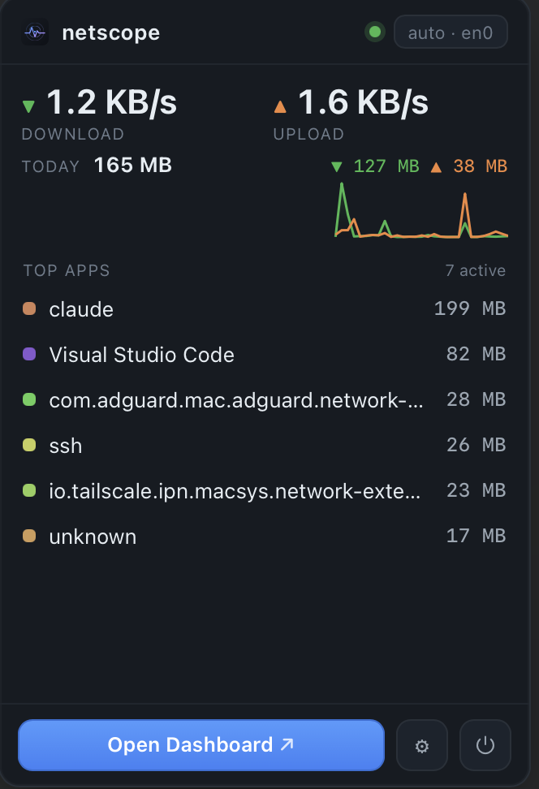
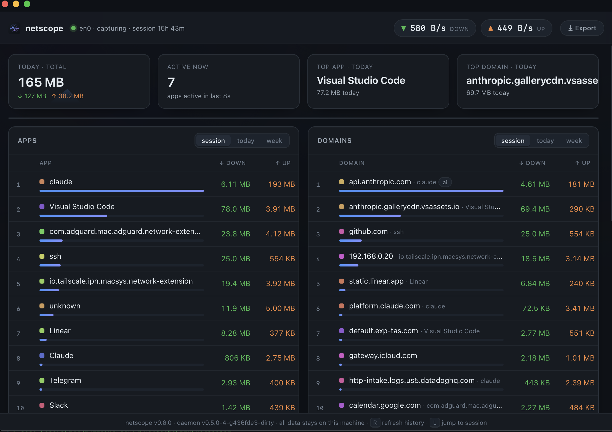

<div align="center">


# netscope

**See which apps are using your network — live, right from the menu bar.**

[](https://github.com/doldoldol21/netscope/releases)
[](LICENSE)


<br />


<p><em>live download &amp; upload, always in your menu bar</em></p>

</div>

---

A per-app network traffic monitor for macOS, in the spirit of RunCat / iStat:
always-on, glanceable, and useful for everyone. Everything runs locally — no
traffic contents are read and nothing leaves your Mac. The capture daemon opens
**no network port** (it serves over a unix socket); only the dashboard window is
fed by a loopback-only (`127.0.0.1`) address.

## ⚡ Quick Start

```sh
curl -fsSL https://raw.githubusercontent.com/doldoldol21/netscope/main/install.sh | bash
```

`netscope.app` lands in **/Applications** and launches immediately — no
Gatekeeper warning (curl-fetched apps aren't quarantined), no Homebrew, no
Apple account. The installer asks for your admin password **once, in the
terminal**, to set up the capture helper. After that, the app opens with zero
pop-ups, live in your menu bar and starting at login.

Click the menu-bar icon for the popover — live rate, today's total, top apps,
and an **Open Dashboard** button for the full window.

---

## ✨ Features

| | |
|---|---|
| 🔴 **Live menu bar** | A ↓↑ rate readout next to the icon (pick a style and optional color), today's total, and a dropdown of top apps. Switch capture interface from the top-right chip (`auto · en0`). |
| 📊 **Dashboard** | A native window with a throughput chart (live · day · week · month), rankings, per-domain breakdown with category chips, and **per-app drill-down** — click any app for its own chart and domain list. |
| 🚨 **Usage alerts** | macOS notifications when today's traffic crosses a daily or per-app limit. Separate **upload alerts** catch surprise backups and cloud syncs sending data off your Mac. |
| 🔄 **Auto-update** | Checks GitHub for new releases and updates itself in one click, with a notification when a new version ships. |
| 📤 **Export** | CSV / JSON from the dashboard (full bundle or one app's domains) and the CLI (`netscope export`). |
| ⌨️ **CLI** | `netscope`, `netscope apps --range week`, `netscope domains`, `netscope export … > out.csv`. |
| 🔒 **Private by design** | HTTPS stays encrypted. netscope only counts *bytes per process* and maps IPs to domains from your own DNS replies, reverse-DNS, and the cleartext TLS SNI. |

<div align="center">


&nbsp;&nbsp;


*menu-bar popover &nbsp;·&nbsp; full dashboard window*

</div>

---

## 🏗️ How it works

```text
┌── netscoped (root, launchd) ──────────────────────┐
│  libpcap capture ─► decode (IP/TCP/UDP, DNS, SNI)  │
│        │                    │                       │
│        ▼                    ▼                       │
│  resolver (libproc)    dnscache (IP→domain)        │
│   socket→PID→app       DNS + reverse-DNS + SNI     │
│        │                    │   (persisted to disk) │
│        └──────► engine (attribute + aggregate)      │
│                     │            │                  │
│                     ▼            ▼                  │
│                 SQLite       live snapshot          │
│                     └─────┬────────┘                │
│                           ▼                          │
│                   /api over UNIX SOCKET             │
└───────────────────────────┬────────────────────────┘
              unix:///var/run/netscope/netscoped.sock
              (0600, owned by you)
          ┌───────────────────┴───────────────────┐
          ▼                                        ▼
   netscope.app  (one app)                   netscope CLI
   menu bar + dashboard; installs            terminal viewer
   and manages the daemon for you
```

### Why a daemon, wrapped in one app

Packet capture needs root (`/dev/bpf*`); a GUI must run unprivileged in your
login session. netscope keeps these separate under the hood but ships them as a
**single `netscope.app`**:

| Component | Role |
|---|---|
| **`netscoped`** (bundled in the app) | Runs as root under launchd. Captures & aggregates, serves `/api` on a unix socket. **No network port** — access is gated by socket ownership (`chown`ed to you, mode `0600`). |
| **`netscope.app`** | Menu-bar app (no dock icon): native `NSStatusItem` (cgo) with a frameless **Wails popover**. The "Open Dashboard" button opens a **separate native window** (`NSWindow` + `WKWebView`), fed by a loopback-only (`127.0.0.1`) server that reverse-proxies `/api` (incl. live SSE stream) to the socket. |
| **`netscope`** | CLI that reads the same socket for terminal views. |

---

## 🔍 How attribution works

### bytes → process
macOS has no "4-tuple → PID" syscall, so the resolver periodically enumerates
every process' socket file descriptors via `libproc` and builds a reverse index
keyed by `protocol + local port + remote endpoint`.

### IP → domain
Three complementary sources, deduped into one cache **persisted to disk** so
domains survive a restart:

1. **DNS** — sniffs DNS responses, caches each `A`/`AAAA` answer against the
   queried name.
2. **TLS SNI** — reads the cleartext `server_name` in outbound TLS ClientHello
   to identify servers with no DNS answer or PTR record (OpenAI, Cloudflare,
   …). The session stays encrypted; only the hostname is read.
3. **reverse DNS (PTR)** — background fallback for any IP still unnamed.

### category
Domains are matched (by registrable suffix) into neutral groups
(`cloud` · `cdn` · `media` · `social` · `ai` · `tracking`), shown as a chip.

### country
Each remote IP is mapped to its country (flag in the dashboard) using an
**embedded, offline** database — no external GeoIP lookups, so the IPs you
contact never leave your machine.

---

## 🛡️ Resilience

- **Interface changes** — the capture supervisor follows the real default route
  and transparently re-opens capture across Wi‑Fi ↔ Ethernet / VPN switches,
  with no restart. Pin a specific interface from the popover's top-right chip.
- **Disk safety** — hard DB size cap, WAL checkpointing, and VACUUM keep the
  capture database from ever filling your disk (time-based retention too).

---

## 📦 Install

### App (recommended)
The [Quick Start](#-quick-start) one-liner. Installs `netscope.app` to
`/Applications` with no Gatekeeper prompt.

### CLI / Homebrew
```sh
brew install doldoldol21/netscope/netscope-cli
```
Builds `netscoped` and `netscope` binaries from source (also no Gatekeeper).

### Direct download
Grab `netscope.app` from the
[latest release](https://github.com/doldoldol21/netscope/releases). If
downloaded in a browser, clear the quarantine flag:
```sh
xattr -dr com.apple.quarantine /Applications/netscope.app
```

### Uninstall
```sh
sudo launchctl bootout system/io.netscope.daemon 2>/dev/null
sudo rm -f /Library/LaunchDaemons/io.netscope.daemon.plist
rm -rf /Applications/netscope.app
launchctl bootout gui/$(id -u)/io.netscope.app 2>/dev/null
rm -f ~/Library/LaunchAgents/io.netscope.app.plist
sudo rm -rf /var/db/netscope /var/run/netscope
```

---

## ⌨️ Usage

### CLI viewer (no root — talks to the running daemon)

```sh
bin/netscope                 # live terminal table (default: "top")
bin/netscope apps --range week
bin/netscope domains --range today
bin/netscope export --type apps --range week --format csv > apps.csv
bin/netscope export --type domains --range today --format json > domains.json
bin/netscope open            # launch the native app
```

`--range` is one of `hour | today | day | week`. Point at a non-default socket
with `--sock /path/to.sock`.

### Demo / development (no root)

```sh
make demo            # synthetic-traffic daemon + menu-bar app (ChatGPT, Safari, …)
make demo-daemon     # terminal 1: synthetic daemon  (for UI hot-reload)
make app-dev         # terminal 2: dashboard with live-reload
```

### From source

Requires **Go 1.25+** and **macOS** (Xcode Command Line Tools for the C
toolchain).

```sh
git clone https://github.com/doldoldol21/netscope
cd netscope
make build          # bin/netscoped, bin/netscope
make app            # dist/netscope.app (cgo NSStatusItem + Wails popover)
make package        # dist/ : app, zip, CLI, installer (ad-hoc signed)
```

---

## ⚙️ Daemon flags

```
--iface       interface to capture (default: auto-detect; switchable at runtime)
--pcap        replay a pcap file instead of live capture (no root)
--demo        serve synthetic named-app traffic (no root; for UI/dev)
--sock        unix socket to serve the API on ($NETSCOPE_SOCK or /var/run/...)
--db          SQLite path (default /var/db/netscope/netscope.db as root)
--no-store    run in memory only, no persistence
--retention   how long to keep samples (default 720h; 0 = forever)
--max-db      hard cap on DB size in bytes; oldest data dropped to stay under it
--bucket      aggregation/flush granularity (default 10s)
--live-window keep apps/domains in the live view if active within this window
```

---

## 🔌 API (over the unix socket)

JSON only — no static files, no TCP. Probe with:
```sh
curl --unix-socket /var/run/netscope/netscoped.sock http://x/api/health
```

| Endpoint | Description |
|---|---|
| `GET /api/snapshot` | Current live snapshot (rates + session apps/domains) |
| `GET /api/live` | Server-Sent Events stream of snapshots (1/s) |
| `GET /api/apps?range=today` | Per-app totals over a range |
| `GET /api/domains?range=today[&app=NAME]` | Per-domain totals (optionally for one app) |
| `GET /api/summary?range=today` | Totals, counts, top app + top domain |
| `GET /api/timeseries?range=week[&app=NAME]` | rx/tx time series |
| `GET/POST /api/interfaces` | List / switch the capture interface |
| `GET /api/version` | Running version + available update |
| `GET /api/health` | Liveness + persistence status |

---

## 🔐 Privacy

Everything stays on your Mac. netscope counts **bytes per process** and maps
IPs to domains from data your machine already sends/receives (DNS replies, TLS
SNI, reverse DNS). HTTPS payloads are never decrypted. The daemon opens no
network port; the CLI and app reach it only through a `0600` unix socket owned
by you.

---

## ⚠️ Limitations

- **macOS only** in Phase 1 (Linux is a Phase 2 goal). Non-darwin builds compile
  but capture is stubbed out.
- HTTPS payloads are never decrypted — you see domain + byte counts only.
- Encrypted ClientHello (ECH) hides the SNI; such hosts fall back to DNS/PTR.
- Offline pcap replay shows apps as `unknown` (the original sockets are gone);
  live capture resolves real app names.

---

## 🧪 Development

```sh
make test       # unit + offline integration tests (no root needed)
make cover
make vet
make fmt
```

---

## 🙏 Credits

IP-to-country data is **DB-IP IP-to-Country Lite** (<https://db-ip.com>),
licensed [CC BY 4.0](https://creativecommons.org/licenses/by/4.0/). Refresh the
embedded copy with `scripts/gen-geoip.sh`.

---

## 📄 License

MIT — see [LICENSE](LICENSE).
