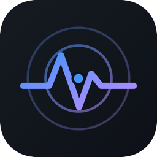
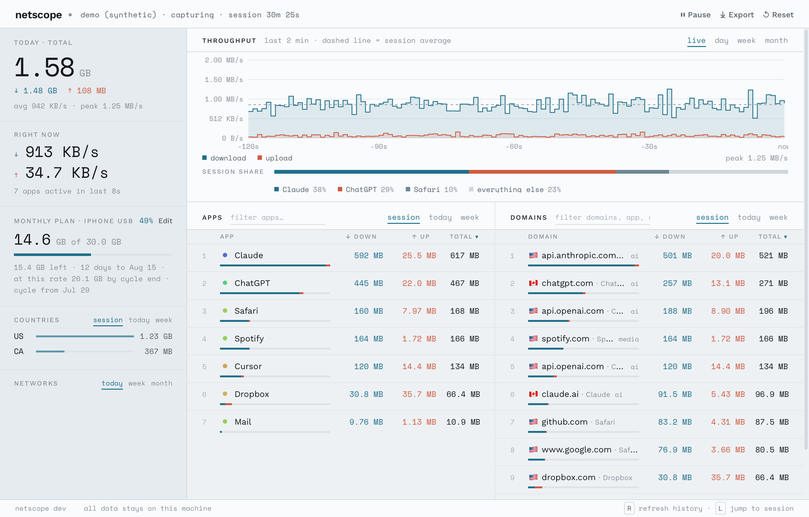
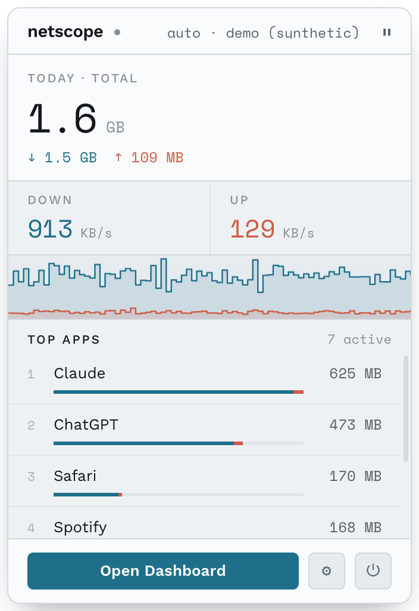
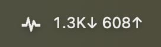

<div align="center">



# netscope

**See which apps are using your network — live, right from the menu bar.**

A per-app network traffic monitor for macOS. Everything runs locally: no
traffic contents are read, nothing captured leaves your Mac, and the capture
daemon opens no network port.

[](https://github.com/doldoldol21/netscope/releases)
[](LICENSE)





&nbsp;&nbsp;


</div>

## Install

```sh
curl -fsSL https://raw.githubusercontent.com/doldoldol21/netscope/main/install.sh | bash
```

`netscope.app` lands in /Applications and launches — no Gatekeeper prompt, no
Homebrew, no Apple account. The installer asks for your admin password once (in
the terminal) to set up the capture helper. The download is verified against
the release's SHA-256 `checksums.txt`.

Other ways: `brew install --cask doldoldol21/netscope/netscope`, or grab the
app from the [latest release](https://github.com/doldoldol21/netscope/releases)
(then `xattr -dr com.apple.quarantine /Applications/netscope.app` if a browser
downloaded it).

## Features

- **Menu bar** — live ↓↑ rate readout (choose style/color) and a popover with
  today's total and top apps.
- **Dashboard** — throughput chart (live/day/week/month), per-app and
  per-domain rankings with search and sorting, per-app drill-down, live
  connections, traffic by country (offline GeoIP — no external lookups).
- **Alerts** — macOS notification when today's total, uploads, or a single app
  crosses a limit you set.
- **Monthly data plan** — track a tethered phone's allowance per billing cycle
  (used, left, projected).
- **Self-updating** — checks GitHub Releases and updates in one click;
  downloads are SHA-256 verified.
- **CLI** — `netscope`, `netscope apps --range week`,
  `netscope export … > out.csv`.
- **Localized** — follows your system language (English, 한국어, 日本語).

## How it works

A root capture daemon (`netscoped`, bundled in the app, managed by launchd)
counts bytes per process with libpcap + `libproc` and maps IPs to domains from
your own DNS replies, TLS SNI, and reverse DNS — HTTPS stays encrypted. It
serves JSON over a `0600` unix socket only; the app's dashboard window talks to
it through a loopback-only proxy. Details in
[CONTRIBUTING.md](CONTRIBUTING.md).

## Privacy

Captured data stays on your Mac. Bytes and hostnames only — payloads are never
decrypted, nothing captured is uploaded, and the country lookup uses an embedded
offline database, so no address is ever sent to a geolocation service.

Two things do go out, both ordinary network requests rather than capture data:

- **Reverse DNS.** Any IP that no observed DNS answer and no TLS SNI has already
  named gets a PTR lookup, which tells whoever runs your resolver — an ISP, a
  VPN, a workplace — which addresses this machine reached. DNS and SNI naming
  are passive by comparison: they read replies your machine was receiving
  anyway. `netscoped --no-revdns` stops the lookups; names an earlier run
  already learned stay in the on-disk cache, since the flag prevents new
  queries rather than erasing old answers.
- **Update checks.** Every few hours the app asks `api.github.com` for the
  latest release, and the daemon makes the same check to fill `/api/version`.
  These are separate: *Automatic updates* in settings stops the app's check
  only, and the daemon's needs `netscoped --no-update-check`.

Daemon flags live in `/Library/LaunchDaemons/io.netscope.daemon.plist` under
`ProgramArguments`. After editing it, make launchd re-read the file — a restart
keeps the definition it already loaded:

```sh
sudo launchctl bootout system/io.netscope.daemon
sudo launchctl bootstrap system /Library/LaunchDaemons/io.netscope.daemon.plist
```

Reinstalling the capture helper rewrites that plist, so flags added by hand need
re-applying afterwards.

## Develop

Requires Go 1.25+ and Xcode Command Line Tools.

```sh
make demo       # synthetic daemon + app, no root needed
make test       # unit + offline integration tests
make app        # dist/netscope.app
make package    # dist/: app, zip, checksums, installer
```

## Uninstall

```sh
sudo launchctl bootout system/io.netscope.daemon 2>/dev/null
sudo rm -f /Library/LaunchDaemons/io.netscope.daemon.plist
rm -rf /Applications/netscope.app ~/Library/LaunchAgents/io.netscope.app.plist
sudo rm -rf /var/db/netscope /var/run/netscope
```

## Credits & license

IP-to-country data: [DB-IP Lite](https://db-ip.com)
([CC BY 4.0](https://creativecommons.org/licenses/by/4.0/)). Fonts: Work Sans
and Space Mono (SIL OFL 1.1). Code: MIT — see [LICENSE](LICENSE).
